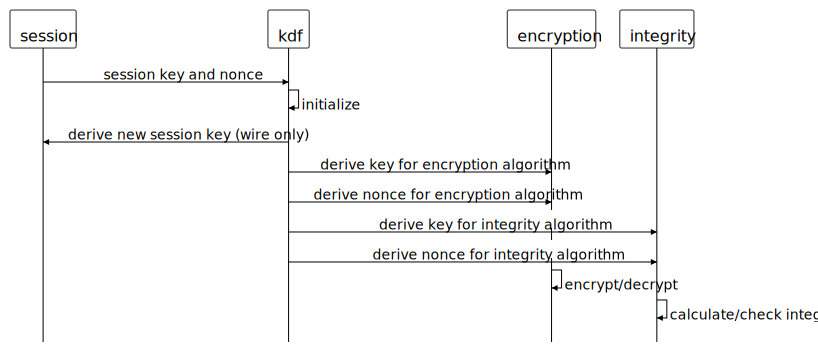
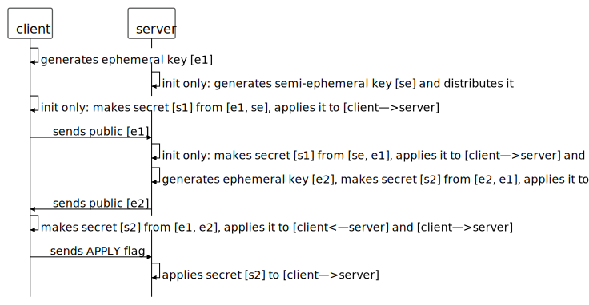

# Jess Specification

## Basics

The basic building blocks of jess are:

#### Envelope

Envelopes hold the configuration for cryptographic operations.

Given an envelope and and a message, jess creates a letter, an encrypted container that also holds any information needed to successfully open the letter, if the keys/passwords are supplied.

#### Letter

Given an envelope and and a message, jess creates a letter - an encrypted container that also holds any information needed to successfully open the letter, if the keys/passwords are supplied.

#### Signet / Recipient

Signets hold secrets, such as a private key. Recipients represents the public (ie. secret-less) versions of signets.

#### Seal

Seals hold key establishment data, such as public keys or encapsulated keys.

#### Requirements

Every operation is subject to requirements:

- Confidentiality
- Integrity
- Recipient Authentication
- Sender Authentication

## Stored Data

The basic ability of jess is to open and close letters - discrete data blobs, such as a file stored on disk.

The algorithms used depend on the requirements, normally the full range of key exchange, encryption, MAC, and signing is used. Keys are established as with the wire protocol, but stop as soon as `[client—>server]` shared key has been established.

## Wire Protocol

The wire protocol is requires the Confidentiality, Integrity and Recipient Authentication requirements.

Keys are established using ephemeral keys and are re-established frequently, providing forward secrecy:
- Even if the static key is compromised, data encrypted in the past will remain secured.
- An attacker must execute an active Man-in-the-Middle attack or continually compromise all ephermal keys in order to sustain full compromise.
- If a session key is compromised, only encrypted data until the next key re-establishment will be compromised.

Continually evolving session keys provide backward secrecy:
- Even if a session key is compromised, data encrypted before the compromise remains secured.

Connections are established in a 0-RTT (zero round trip time) manner, enabling the first message to carry data. The caveat is that until the first key establishment has fully finished, transmitted data from the client to the server will be only protected by the static key (ie. without forward secrecy).

When used for tunneling or with a sub-protocol, this usually won't be an issue, as the sub-protocol will most likely have a synchronous establishment procedure anyway, guaranteeing a full key establishment when the sub-protocol is finished with it's own setup.

There will be a way to force a full establishment before transmitting data in the future.

This protocol is also inspired by the Double Ratchet Algorithm.

If you are familiar with the Noise Protocol Framework, you will notice that this protocol is very similar to the "NK handshake". The main difference is that the handshake of this protocol is asynchronous, is periodically repeated and it uses evolving keys, making it suitable for long lived high-volume connections.

Currently, all key establishment elements and signatures are not hidden and can be seen on the wire. This will change in a future protocol version. Also, signatures, pre-shared keys and passwords - as part of the handshake - are not yet supported and future support is uncertain.

### Keys and Nonces

In order to dynamically support different types of algorithms, Jess always uses a KDF to provide keys and nonces to algorithms:

<!--
edit here:
www.diagram.codes/d/sequence

source:
alias s="session"
alias k="kdf"
alias e="encryption"
alias i="integrity"

s->k: "session key and nonce"
k->k: "initialize"
k->s: "derive new session key (wire only)"
k->e: "derive key for encryption algorithm"
k->e: "derive nonce for encryption algorithm"
k->i: "derive key for integrity algorithm"
k->i: "derive nonce for integrity algorithm"
e->e: "encrypt/decrypt"
i->i: "calculate/check integrity"
-->

### Key Establishment Procedure with DH Based Algorithm

`init only` signifies steps that are only performed in the initial handshake. Other steps are performed for both the initial handshake and renewals. The semi-ephemeral keys `[se]` are rather short-lived keys (hours to days), that are securely distributed in a separate manner.

<!--
edit here:
www.diagram.codes/d/sequence

source:
alias c="client"
alias s="server"

c->c: "generates ephemeral key [e1]"
s->s: "init only: generates semi-ephemeral key [se] and distributes it"
c->c: "init only: makes secret [s1] from [e1, se], applies it to [client—>server]"

c->s: "sends public [e1]"
s->s: "init only: makes secret [s1] from [se, e1], applies it to [client—>server] and [client<—server]"
s->s: "generates ephemeral key [e2], makes secret [s2] from [e2, e1], applies it to [client<—server]"

s->c: "sends public [e2]"
c->c: "makes secret [s2] from [e1, e2], applies it to [client<—server] and [client—>server]"

c->s: "sends APPLY flag"
s->s: "applies secret [s2] to [client—>server]"
-->

### Key Establishment Procedure with Key Encapsulation

`init only` signifies steps that are only performed in the initial handshake. Other steps are performed for both the initial handshake and renewals. The semi-ephemeral keys `[se]` are rather short-lived keys (hours to days), that are securely distributed in a separate manner.

<!--
edit here:
www.diagram.codes/d/sequence

source:
alias c="client"
alias s="server"

c->c: "generates ephemeral key [e1]"
s->s: "init only: generates semi-ephemeral key [se] and distributes it"
c->c: "init only: creates secret [s1], applies it to [client—>server], encapsulates it with [se] to get [c1]"

c->s: "sends public [e1]"
c->s: "init only: sends [c1]"
s->s: "init only: gets secret [s1] from [se, c1], applies it to [client—>server] and [client<—server]"
s->s: "creates secret [s2], applies it to [client<—server], encapsulates it with [e1] to get [c2]"

s->c: "sends [c2]"
c->c: "gets secret [s2] from [e1, c2], applies it to [client<—server] and [client—>server]"

c->s: "sends APPLY flag"
s->s: "applies secret [s2] to [client—>server]"
-->
